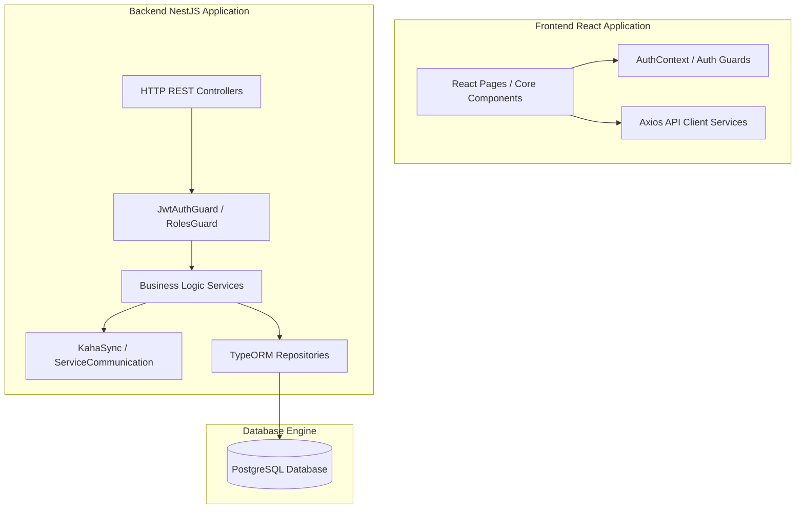
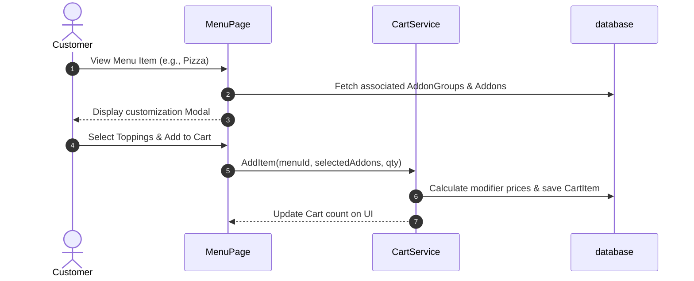
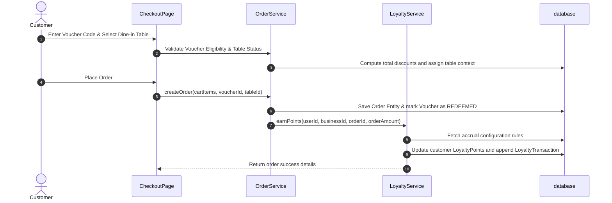

# KAHA Verse - Complete Restaurant E-Commerce & Loyalty Platform Handover Documentation

This document serves as the official, comprehensive project handover documentation for the entire **KAHA Verse Restaurant E-Commerce & Loyalty Reward System**. It details the clean architecture design, database entity schemas, module inter-dependencies, step-by-step operational workflows, and integration details to ensure successful maintenance and future onboarding by incoming developers.

---

## 📖 Executive Summary
KAHA Verse is a multi-tenant, enterprise-grade restaurant e-commerce ecosystem consisting of a secure backend server and a responsive client portal. It handles the complete lifecycle of food commerce—from menu configurations, cart composition, dine-in table mapping, order processing, and tracking, to loyalty rewards, promotional campaigns, and automated point ledger calculations.
- **Client/Owner**: Ishwor Gautam (Super Admin)
- **Developer**: Arju Thapa (Full-Stack Developer)
- **Primary Tech Stack**: NestJS, React 18, TypeScript, PostgreSQL (TypeORM), TailwindCSS/Vanilla CSS.

---

## 🏛️ Clean Architecture & Design System

The platform is designed around **Clean Coding Principles** and a layered modular architecture, cleanly separating network protocols, business rule execution, storage interactions, and visual user components.



### 1. Frontend Architectural Layers (`/kaha_Restarant_Eecommerce_Frontend`)
- **Visual & Pages Layer (`src/pages`)**: Houses view-specific pages separated into Admin and Customer roles. Views are built with conditional skeleton loading to improve perceived speed.
- **Shared Components (`src/components`)**: Reusable UI blocks such as custom navigation bar, modal forms, dynamic table lists, card layouts, and error boundaries.
- **Authentication Context (`src/context/AuthContext.tsx`)**: Manages the application-wide security state, verifying local tokens, parsing claims, and controlling role-based route permissions.
- **API Services Layer (`src/api`)**: Module-specific endpoints (e.g., `loyaltyApi`, `orderApi`, `tableApi`, `menuApi`) routing requests through a central Axios instance (`axios.ts`) configured with request interceptors for automated JWT injection.

### 2. Backend Architectural Layers (`/restaurant-ecommerce`)
- **Controllers Layer (`*.controller.ts`)**: Defines HTTP routing, payload validations (using `ValidationPipe` with `class-validator`), and API documentation attributes.
- **Services Layer (`*.service.ts`)**: Encapsulates transaction logic, calculating itemized order discounts, validating voucher rules, applying loyalty bonuses, and checking stock availability.
- **Repository & Entity Layer (`*.entity.ts`)**: Implements TypeORM schemas mapping PostgreSQL tables, relations, indexes, and cascades.
- **Synchronizer Layer (`kaha-sync`)**: Operates integration queries sync with the parent platform.

---

## ⚙️ Comprehensive Module Breakdown

### 1. Authentication & Security
- **Backend (`src/modules/auth`)**: Uses standard Passport JWT strategy. Custom `@Roles()` decorator determines role permissions.
- **Frontend Pages**:
  - `LoginPage.tsx` & `RegisterPage.tsx`: Standard client authentication.
  - `AdminLoginPage.tsx`: Restricts access to authorized restaurant managers (`ADMIN`, `BUSINESS_SUPER_ADMIN`).

### 2. Menu, Categories & Add-Ons
Handles the restaurant product catalog including customization groups.
- **Entities**:
  - `CategoryEntity`: Stores categories (e.g., Appetizers, Main Course, Drinks) with sort ordering.
  - `MenuEntity`: Individual menu items with price, image path, description, and status tags (`isActive`, `isAvailable`).
  - `AddonGroupEntity`: Group options (e.g., "Choose Toppings", "Size Selection") with multi-select bounds.
  - `AddonEntity`: Individual custom options with additional pricing.
- **Admin Management**: Full CRUD interface in the Admin Dashboard with quick-toggle availability switches to flag out-of-stock items.

### 3. Cart & Ordering Engine
Calculates item combinations, modifiers, and persistent user checkouts.
- **Cart Persistent Logic**: Synchronizes the guest cart state with the backend `cart` tables on user authentication, computing current subtotals, item taxations, and add-on pricing modifiers.
- **Order Lifecycle States**:
  - `PENDING`: Order created, awaiting restaurant confirmation.
  - `PREPARING`: Confirmed, active in kitchen queue.
  - `READY`: Food is ready for pickup/dine-in service.
  - `DELIVERED` / `COMPLETED`: Lifecycle closed successfully.
  - `CANCELLED`: Rejected or aborted order.

### 4. Dine-In Table Management
Maps physical tables for table-side dining, QR code orders, and billing.
- **Entities**:
  - `RestaurantTableEntity`: Tracks `tableNumber`, `capacity`, `section` (Indoor, Outdoor, Terrace, Bar), and `isActive` status.
- **Checkout Integration**: Automatically detects table assignments for `DINE_IN` orders, letting waitstaff locate customers instantly.

### 5. Loyalty Points & Ledger Engine
Tracks points accrual, lifetime stats, and ledger transactions.
- **Entities**:
  - `LoyaltyPointsEntity`: Customer point balance, total orders, and total spent.
  - `LoyaltyTransactionEntity`: Ledger logs for auditing point events.
- **Config Settings**: Adjustable options for points-to-NPR rates, minimum redemption points, expiry durations, and multiplier rules.

### 6. Marketing Campaigns & Vouchers
Enables single and criteria-based mass awarding of campaign coupons.
- **Voucher Validation Sequence**:
```
Customer Code Input ──► Is Active? ──► Valid Expiry? ──► Min Order Met? ──► Target Customer Matches? ──► Apply Discount
```
- **Mass Awarding Criteria**:
  - *All Users*: Awards to all registered loyalty customers.
  - *Min Orders*: Focuses on high-retention customers who ordered $\ge N$ times.
  - *Min Spent*: Focuses on high-spending VIP customers who spent $\ge X$ NPR.

### 7. Menu Ratings & Reviews
Enables customers to review individual menu items from their orders.
- **Entities**:
  - `MenuRatingEntity`: Holds ratings (1-5), comments, visibility toggles, and relation links to order items.
- **Core Rules**:
  - Customers can only review items they have explicitly ordered and completed.
  - Only one review is permitted per item per order.
  - Admins can moderate reviews (toggle visibility) in the dashboard.

### 8. Parent Platform Synchronization (`kaha-sync`)
Coordinates integration with external platform systems.
- **Components**:
  - `KahaSyncService`: Automatically triggers pulls for menu profiles, category organizations, and global business parameters, ensuring data consistency across tenant restaurants.

---

## 🔄 Core System Workflows & User Journeys

### 1. Interactive Menu Selection & Customization


### 2. Check-out, Table Mapping, Voucher Apply & Point Accrual


### 3. Kitchen & Delivery Order Lifecycle Tracking
- Restaurant staff view active orders inside the **Admin Dashboard (Orders Queue)**.
- Staff click buttons to advance the status: `PENDING` $\rightarrow$ `PREPARING` $\rightarrow$ `READY` $\rightarrow$ `COMPLETED`.
- Customer views live status updates on `OrderDetailPage.tsx` showing the order preparation timeline.

---

## 🛠️ Installation, Setup & Local Running

### 1. Database Setup
Ensure PostgreSQL is running locally. Create a database named `kaha_resto_db` (or configured name in your backend `.env`).

### 2. Backend Service Running
```bash
# 1. Navigate to the backend application folder
cd /home/kali/Documents/KAHA_Verse/Kaha_restaurant-ecommerce/restaurant-ecommerce

# 2. Install dependencies
npm install

# 3. Apply database migration schemas
npm run migration:run

# 4. Start the application in development mode
npm run start:dev
```
*Port configurations can be reviewed in `/src/main.ts` (Default: `http://localhost:3000`).*

### 3. Frontend Client Running
```bash
# 1. Navigate to the frontend application folder
cd /home/kali/Documents/KAHA_Verse/kaha_Restarant_Eecommerce_Frontend

# 2. Install dependencies
npm install

# 3. Start development server
npm run dev
```
*Frontend hot reloading operates on: `http://localhost:5173`.*

---

## 🔌 External Integration: Kaha Main V3 Server Bridge

The platform relies on the external **Kaha Main V3 API Gateway** (`https://api.kaha.com.np/main/api/v3`) for cross-service authentication, business profile retrieval, and tenancy role mappings. This is managed by the `ServiceCommunicationService` in the backend:

1. **Authentication Tunneling**:
   - Customer and Admin logins bypass local tables and query `POST /auth/login` on the external Kaha Main V3 server.
   - On successful authentication, the external server issues access tokens which are locally validated via our `JwtStrategy` inside `auth.service.ts`.

2. **Business & Ownership Mappings**:
   - When an admin logs in, their permissions (e.g. `BUSINESS_SUPER_ADMIN`, `ADMIN`) are resolved dynamically by querying:
     - `GET /business-users` (to get memberships).
     - `GET /business-users/{businessId}/{userId}` (to load active roles).
   - This prevents local database sync issues, ensuring business owners maintain full operational rights instantly as configured in the central Kaha ecosystem.

3. **Business Profile Context**:
   - `GET /businesses/{id}` retrieves dynamic details (working hours, geo-location, tags, contact) from the main server.

---

## 🛡️ Reliability, Resiliency & Validation Safeguards
- **Sync Fallbacks**: A fallback business ID is implemented in controllers to prevent backend 500 errors in case external Kaha platform communication fails.
- **Input Guardrails**:
  - Voucher codes are automatically standardized (whitespace stripped, uppercase).
  - Validation decorators (`IsString`, `IsNumber`, `Min`) ensure bad requests are blocked at the boundary.
- **Auth Guardrails**: React route protections prevent non-admin users from accessing dashboard endpoints.

---

## 🚀 Recommended Developer Guidelines (Onboarding)
- **Adding Database Fields**: Always use TypeORM migrations (`npm run migration:generate --name=AddFields`) instead of changing entities directly to prevent production database mismatches.
- **State Management**: For general customer state, modify context files under `src/context/` rather than adding prop-drilling inside individual UI page files.
- **Testing Endpoints**: Use Swagger UI docs available at `http://localhost:3000/api` (when running locally in development mode) to trace payload structures.
